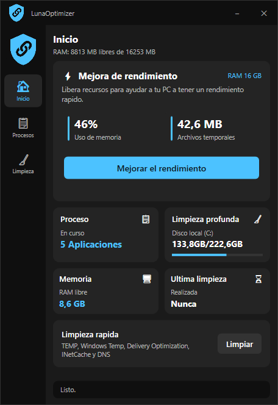
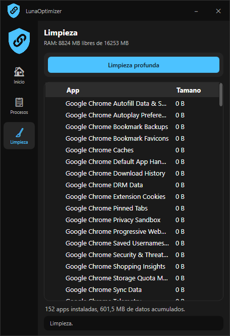
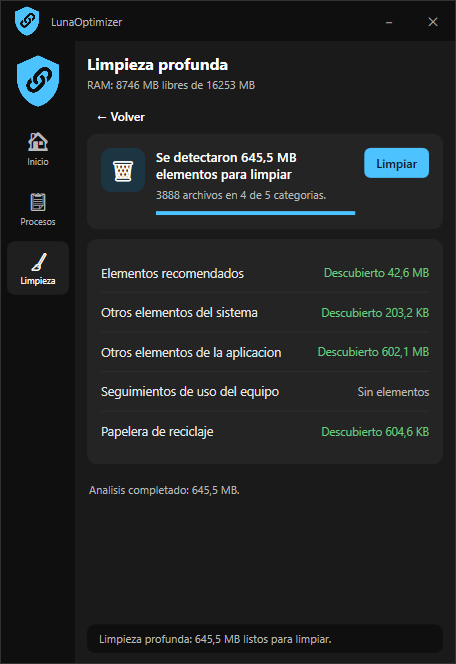

# LunaOptimizer ⚡

Optimizador de PC para **Windows 10/11** con interfaz estilo *Microsoft PC Manager*.
Una sola ventana de 456×664 con tres pestañas: **Inicio**, **Procesos** y **Limpieza**.

- **Sin instalación**: es un `.exe` único y autocontenido (no hace falta tener .NET instalado).
- **Todo en español**, sin telemetría, sin anuncios, sin suscripciones.
- Motor de limpieza basado en [FluentCleaner](https://github.com/builtbybel/FluentCleaner) (MIT) y la base de reglas **Winapp2.ini**.

---

## Descargar

1. Entra en **[Releases](https://github.com/juanmarin19/LunaOptimizer/releases)** y descarga **`LunaOptimizer-v4.exe`**.
2. Doble clic → acepta el **UAC** (Windows pregunta por permiso de administrador).
3. Ya está: no hay instalador, puedes dejarlo en el Escritorio o en una memoria USB.

**Requisitos:** Windows 10 o 11 (x64). Nada más.

> ⚠️ **El programa pide administrador siempre.** Es necesario para cerrar procesos de
> otros programas, vaciar la caché del sistema y limpiar `%WINDIR%\Temp`. Si le dices
> "No" en el aviso de Windows, la aplicación no arranca.

---

## Cómo se usa

### 🏠 Inicio



| Zona | Qué hace |
|---|---|
| **Mejorar el rendimiento** | Vacía la *working set* de todos los procesos y fuerza el GC. **No cierra ninguna app.** Muestra los procesos optimizados y la RAM ganada. |
| **Limpieza rápida** | Borra archivos temporales (`%TEMP%`, `C:\Windows\Temp`, *Delivery Optimization*, *INetCache*) y hace `ipconfig /flushdns`. |
| **Tarjetas de estado** | Aplicaciones en curso, disco local (C:), memoria libre y **última limpieza** (hora). |
| **Limpieza profunda** | Abre directamente la pantalla de escaneo profundo. |

### 📋 Procesos

Lista **solo las aplicaciones que es seguro cerrar**: las que tienen una ventana
visible o son apps de la Store, sin procesos del sistema — el mismo criterio que
usa *Microsoft PC Manager*. Los procesos de fondo (`svchost`, `SearchHost`,
`TextInputHost`, hosts de Windows…) y este propio programa no aparecen.

| Control | Qué hace |
|---|---|
| **Actualizar** | Vuelve a leer la lista. |
| **Finalizar** (en cada fila) | Cierra ese programa entero (todos sus procesos). Hay confirmación previa. |
| **Ubicación** | Abre la carpeta donde está el `.exe` del proceso seleccionado. |
| **Agrupar** | Una fila por programa con todos sus PIDs y su RAM total (activado por defecto). |
| **Auto 2s** | Refresca la lista sola cada dos segundos. |
| **Ver todos** | Muestra también los procesos del sistema y de fondo (modo avanzado). |

- Escribe en el cuadro de **búsqueda** para filtrar por nombre.
- Con **Agrupar** activado, cada programa es **una sola fila** que suma todos sus
  procesos: `brave x23 — 3234,4 MB`, igual que muestra PC Manager.
- **Nunca** se pueden cerrar los procesos del sistema (`csrss`, `lsass`, `dwm`,
  `svchost`, `explorer`, *Memory Compression*…): están en una lista protegida,
  y si activas **Ver todos** aparecen marcados como no cerrables.
- Si un programa "no responde", pulsa **Finalizar** en su fila.

### 🧹 Limpieza



Lista las **aplicaciones instaladas** con el espacio que ocupan sus datos de caché
(reglas de **Winapp2.ini**, embebidas dentro del propio `.exe`: Chrome, Steam, Epic,
Spotify, juegos, etc.). Al abrir la pestaña se analiza sola y muestra el total
`152 apps instaladas, 163,2 MB de datos acumulados.`

El único botón es **Limpieza profunda**, que abre la pantalla de análisis estilo
*PC Manager*:



1. **Examinando** → barra de progreso, `Examinando: <elemento>` y los cinco grupos
   pasan de *Esperando a examinar…* a *Descubierto X*.
2. Al terminar: `Se detectaron X elementos para limpiar` y el botón cambia a **Limpiar**
   (mientras tanto es **Cancelar** y detiene el análisis).
3. **Limpiar** → pide confirmación → borra y muestra `Se liberaron X` / `N archivos
   eliminados`, con cada grupo en verde (*Liberado X*) o amarillo
   (*No liberado (en uso)* si el archivo estaba bloqueado).
4. **← Volver** regresa a la pestaña anterior; la hora de la limpieza aparece en Inicio.

**Grupos analizados:**

| Grupo | Qué incluye |
|---|---|
| Elementos recomendados | `%TEMP%`, `C:\Windows\Temp` y la carpeta Temp de cada usuario. |
| Otros elementos del sistema | *Windows Update*, *INetCache*, *Delivery Optimization*, informes WER. |
| Otros elementos de la aplicacion | Cachés de las apps detectadas con Winapp2.ini. |
| Seguimientos de uso del equipo | Elementos recientes de todos los usuarios. |
| Papelera de reciclaje | Todo lo que hay en la papelera de todos los discos. |

> La base de reglas viaja **dentro del propio `.exe`**, así que funciona en
> cualquier PC sin archivos sueltos.

---

## Preguntas frecuentes

**¿Es seguro?** Sí: no borra nada que no sean temporales, datos de caché marcados
por Winapp2.ini o la papelera, y nunca cierra procesos del sistema. Todo lo que
elimina se pide a confirmación antes.

**¿Cierra mis programas?** No. La mejora de rendimiento solo libera memoria. Solo se
cierra lo que tú marques y confirmes en la pestaña *Procesos*.

**¿No arranca / se cierra solo?** Revisa el log de errores en
`%LOCALAPPDATA%\LunaOptimizer\errores.log` y ábrelo como incidencia en GitHub.

**¿Por qué no hay icono de maximizar?** Porque la ventana es fija (456×664), al
igual que Microsoft PC Manager. Sí se puede minimizar.

---

## Compilar desde el código

Necesitas [.NET 8 SDK](https://dotnet.microsoft.com/download/dotnet/8.0).

```powershell
git clone https://github.com/juanmarin19/LunaOptimizer.git
cd LunaOptimizer

# Compilar
dotnet build .\LunaOptimizer\LunaOptimizer.csproj -c Release

# Publicar un .exe único autocontenido (el mismo que sale en Releases)
dotnet publish .\LunaOptimizer\LunaOptimizer.csproj -c Release -r win-x64 `
  --self-contained true -p:PublishSingleFile=true `
  -p:IncludeNativeLibrariesForSelfExtract=true -o .\out
```

> Todo el código va dentro del propio repo (incluidos `FluentCleaner.Core` y
> `Winapp2.ini`): **no hay submódulos**, un `git clone` normal ya compila.

---

## Créditos

- **[FluentCleaner](https://github.com/builtbybel/FluentCleaner)** de *builtbybel* (MIT) —
  motor de detección/limpieza y archivo `Winapp2.ini`.
- **Winapp2.ini** — base de reglas de limpieza mantenida por la comunidad.
- Interfaz inspirada en **Microsoft PC Manager**.

## Licencia

MIT © LunaOptimizer
